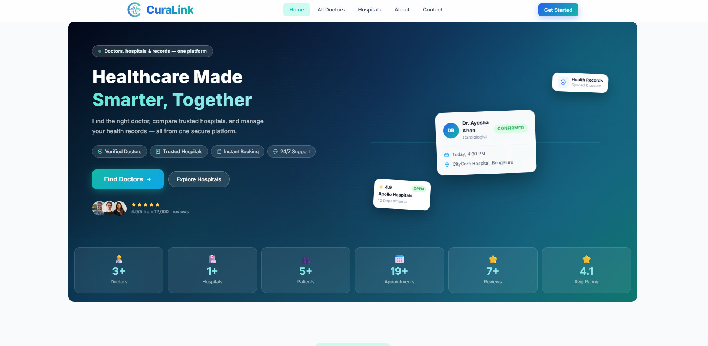
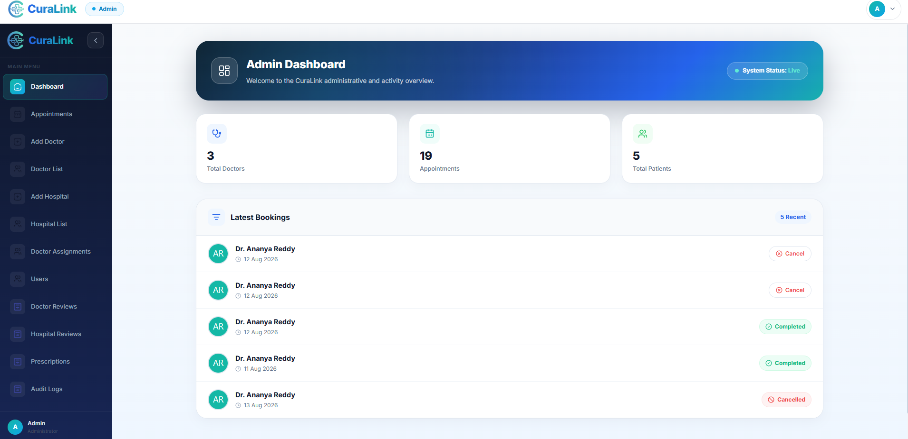
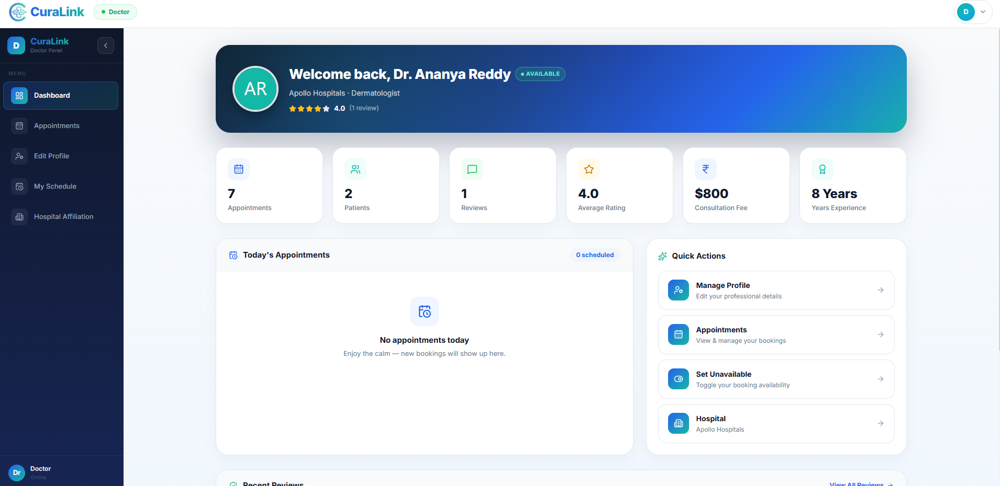
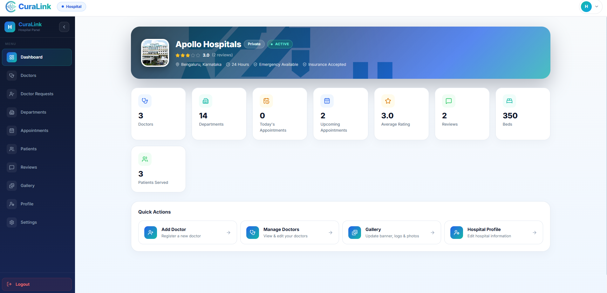
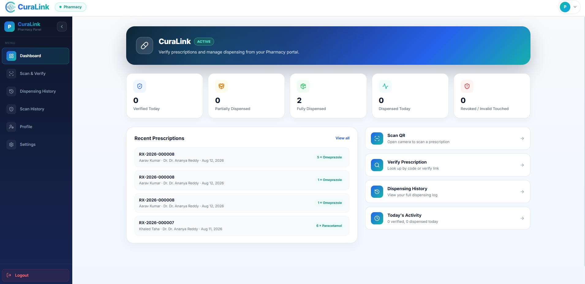
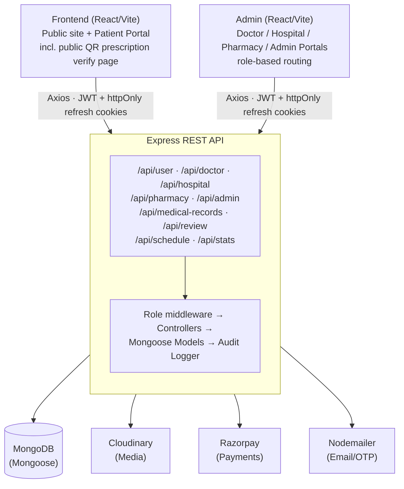
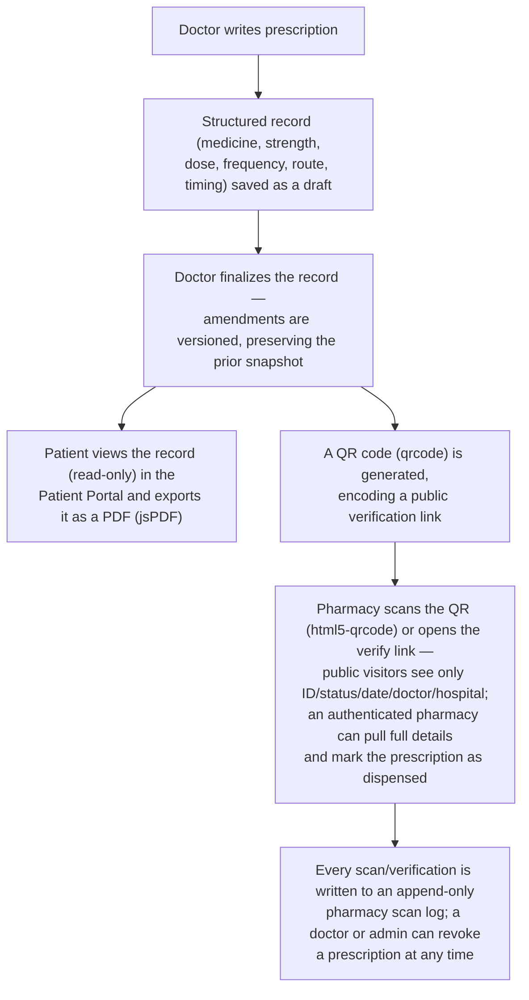

<div align="center">
  

  # CuraLink
  ### Revolutionizing Healthcare Choices with Data

  An AI-era healthcare platform that helps patients discover the right hospitals and doctors, manage appointments end-to-end, and keep their medical records secure — all backed by a role-based, audit-logged Node.js/MongoDB backend.

  <p>
    
    
    
    
    
  </p>
  <p>
    
    
    
    
    
  </p>
</div>

<br />

<div align="center">
  
  <p><em>CuraLink's public homepage — hospital &amp; doctor discovery, platform stats, and patient reviews.</em></p>
</div>

---

## 📑 Table of Contents

- [About CuraLink](#-about-curalink)
- [Features](#-features)
- [Screenshots](#-screenshots)
- [Technologies](#-technologies)
- [System Architecture](#-system-architecture)
- [Folder Structure](#-folder-structure)
- [Installation](#-installation)
- [Environment Variables](#-environment-variables)
- [API Overview](#-api-overview)
- [Security](#-security)
- [Data-Driven Ratings & Insights](#-data-driven-ratings--insights)
- [Digital Medical Records & Prescriptions](#-digital-medical-records--prescriptions)
- [Roadmap](#-roadmap)
- [License](#-license)
- [Author](#-author)

---

## 📖 About CuraLink

Choosing the right hospital or specialist is one of the hardest decisions patients make — usually with the least amount of reliable information. **CuraLink** exists to fix that by turning fragmented healthcare data into a single, trustworthy platform.

CuraLink lets patients:

- **Discover** hospitals and doctors by specialty, department, facilities, and real patient ratings — not guesswork.
- **Compare** providers using aggregated, review-driven ratings that update automatically as new feedback comes in.
- **Book** appointments with integrated Razorpay payments and instant confirmation.
- **Manage** a secure digital health profile — medical history, allergies, medications, insurance, and appointment-linked prescriptions — in one place.
- **Track** every prescription with a structured, versioned record and a downloadable PDF.

On the provider side, CuraLink gives **doctors** a dashboard to manage appointments, availability, and patient records; gives **hospitals** a portal to manage their doctor roster, departments, and patients; gives **pharmacies** a scan-and-dispense workflow for verifying prescriptions via QR code; and gives **administrators** full oversight — verification workflows, platform analytics, review moderation, and a tamper-evident audit log of every sensitive action taken on the platform.

The result is a healthcare ecosystem where decisions are backed by data and every account, role, and action is authenticated, authorized, and logged.

---

## ✨ Features

### 🧑‍⚕️ Patient

| Feature | Description |
|---|---|
| Secure registration & login | Email/password signup, JWT access tokens with rotating refresh tokens and a "Remember Me" option |
| Email verification & OTP password reset | One-time codes emailed via Nodemailer, hashed and time-limited |
| Doctor & hospital search | Browse and filter doctors by specialty and hospitals by department/facility |
| Ratings & reviews | Read and write reviews for doctors and hospitals; see live rating distributions |
| Appointment booking | Book a slot generated from a doctor's live weekly schedule, pay via Razorpay |
| Appointment history | View upcoming and past appointments, cancel when eligible |
| Patient portal | Dashboard, medical records (read-only), prescriptions with **PDF export**, notifications, reviews, and account settings |
| Health profile | Blood group, emergency contact, allergies, chronic conditions, medications, insurance info |

### 🩺 Doctor *(via the Admin app)*

| Feature | Description |
|---|---|
| Doctor authentication | Dedicated login/session flow, independent of patient accounts |
| Dashboard & analytics | Appointment counts, earnings, and patient overview |
| Appointment management | View, complete, or cancel appointments |
| Medical records & prescriptions | Draft, finalize, and amend structured prescriptions (drug, dose, frequency, route, timing) with a full version history |
| Schedule management | Configure a weekly availability pattern, breaks, slot duration, and date-specific overrides |
| Hospital affiliation | Request to join a hospital, accept invites, transfer, or leave |
| Review replies | Respond publicly to patient reviews |

### 🏥 Hospital *(via the Admin app)*

| Feature | Description |
|---|---|
| Hospital dashboard | Appointment, doctor, and rating analytics at a glance |
| Doctor management | Add, edit, remove hospital doctors; control per-doctor schedule-edit permissions |
| Department & facility management | Maintain the hospital's departments, specialties, and facility list |
| Patient directory | List patients treated at the hospital and view per-patient detail |
| Media & gallery | Upload logo, banner, and gallery images via Cloudinary |
| Doctor requests inbox | Approve, reject, or invite doctors to join |
| Review replies | Respond to hospital reviews |

### 💊 Pharmacy *(via the Admin app)*

| Feature | Description |
|---|---|
| Pharmacy authentication | Dedicated login/session flow; accounts are **admin-provisioned only** (no public self-registration) |
| QR prescription scan | Scan a patient's prescription QR (via `html5-qrcode`) or verification link to pull up authorized prescription details |
| Dispense workflow | Mark a verified prescription as dispensed, recorded against the pharmacy account |
| Scan log | Append-only log of every scan/verification attempt for security review |
| Dashboard & history | At-a-glance stats plus a searchable history of past verifications/dispenses |
| Profile & settings | Manage pharmacy profile, license number, and account password |

### 🛡️ Admin

| Feature | Description |
|---|---|
| Platform dashboard | Global stats across users, doctors, hospitals, and appointments |
| Verification workflows | Approve/reject new doctor and hospital registrations |
| User management | List, suspend, or remove patient accounts |
| Appointment oversight | View and cancel any appointment on the platform |
| Review moderation | Toggle review visibility, reply on behalf of the platform, remove abusive content |
| Doctor ↔ hospital control | Assign, transfer, or remove doctor-hospital associations |
| Pharmacy provisioning | Add, edit, and activate/deactivate pharmacy accounts |
| **Audit log system** | Searchable, filterable log of every sensitive action, exportable to CSV |

---

## 📸 Screenshots

<table>
<tr>
<td width="50%">

**Admin Dashboard**


</td>
<td width="50%">

**Doctor Dashboard**


</td>
</tr>
<tr>
<td width="50%">

**Hospital Dashboard**


</td>
<td width="50%">

**Pharmacy Dashboard**


</td>
</tr>
<tr>
<td width="50%">

**Patient Portal Dashboard**
<!-- 📌 Screenshot placeholder — drop the image at docs/screenshots/patient-portal.png -->


</td>
<td width="50%">

**Medical Records / Prescription (with QR + PDF export)**
<!-- 📌 Screenshot placeholder — drop the image at docs/screenshots/prescription-qr.png -->


</td>
</tr>
<tr>
<td width="50%">

**Reviews & Rating Distribution**
<!-- 📌 Screenshot placeholder — drop the image at docs/screenshots/reviews.png -->


</td>
<td width="50%">

**Audit Logs (Admin)**
<!-- 📌 Screenshot placeholder — drop the image at docs/screenshots/audit-logs.png -->


</td>
</tr>
</table>

---

## 💻 Technologies

<table>
<tr>
<td valign="top" width="33%">

**Frontend**

| Tech | Use |
|---|---|
| React 19 | UI library (frontend + admin apps) |
| Vite 7 | Build tool & dev server |
| React Router 7 | Client-side routing |
| Tailwind CSS 3 / 4 | Styling (v3 in `frontend`, v4 in `admin`) |
| Axios | HTTP client with auth interceptors |
| React Toastify | Toast notifications |
| Lucide React | Icon set |
| jsPDF | Client-side prescription PDF export |
| react-phone-number-input | Phone number entry & validation |
| html5-qrcode | Pharmacy-side QR scanning of prescriptions (`admin` app) |

</td>
<td valign="top" width="33%">

**Backend**

| Tech | Use |
|---|---|
| Node.js | Runtime |
| Express 5 | REST API framework |
| Mongoose 9 | MongoDB ODM |
| jsonwebtoken | Access token signing |
| bcrypt | Password hashing |
| express-rate-limit | Per-route & role-tiered rate limiting |
| Helmet | Security headers |
| CORS | Origin allowlisting |
| Multer | File upload handling |
| Nodemailer | Transactional email & OTP delivery |
| validator | Input/email sanitization |
| Morgan / Compression | Logging & response compression |
| qrcode | Server-side QR code generation for prescription verification |

</td>
<td valign="top" width="33%">

**Data, Payments & Infra**

| Tech | Use |
|---|---|
| MongoDB | Primary database |
| Cloudinary | Image/media storage & CDN |
| Razorpay | Appointment payment processing |
| dotenv | Environment configuration |
| ESLint | Linting (frontend & admin) |
| Nodemon | Backend dev auto-reload |

</td>
</tr>
</table>

---

## 🧩 System Architecture



---

## 📂 Folder Structure

```
CuraLink/
├── backend/                     # Express REST API
│   ├── config/                    # MongoDB & Cloudinary connections
│   ├── constants/                  # Prescription enums (drug form, route, timing…)
│   ├── controllers/                # Business logic per resource
│   ├── middlewares/                # authUser / authDoctor / authHospital / authAdmin, multer, rate limiters
│   ├── models/                     # Mongoose schemas
│   ├── routes/                     # Express routers mounted under /api/*
│   ├── seed/                       # Demo data seeding script
│   ├── utils/                      # Tokens, sessions, OTP, email, audit log, sanitization
│   └── server.js                   # App entry point
│
├── frontend/                    # Patient-facing & public React app (Vite)
│   └── src/
│       ├── assets/                  # Logos, doctor photos, specialty icons
│       ├── components/              # Navbar, review widgets, portal layout…
│       ├── context/                  # AppContext — global patient/public state
│       ├── hooks/                    # useCountUp, useInView, useReviewEligibility
│       ├── pages/                    # Home, Doctors, Hospitals, Appointments…
│       │   └── Portal/                # Logged-in patient portal (dashboard, records, prescriptions, notifications)
│       └── utils/
│
├── admin/                        # Doctor / Hospital / Pharmacy / Admin React app (Vite)
│   └── src/
│       ├── assets/
│       ├── components/               # Sidebars, ScheduleEditor, ReviewsPanel…
│       ├── context/                   # AdminContext, DoctorContext, HospitalContext, PharmacyContext
│       ├── pages/
│       │   ├── Admin/                  # Dashboard, verification, users, audit logs…
│       │   ├── Doctor/                  # Dashboard, schedule, appointments, profile
│       │   ├── Hospital/                 # Dashboard, doctors, patients, departments, gallery
│       │   └── Pharmacy/                  # Dashboard, QR scan, dispense history, scan log
│       └── utils/
│
├── CURALINK_THEME.md              # Design system reference (colors, typography, components)
├── LICENSE
└── README.md
```

---

## 🔧 Installation

### Prerequisites

- Node.js 18+
- A MongoDB instance (local or Atlas)
- Cloudinary account (media uploads)
- Razorpay account (payments)
- An SMTP-capable email account for Nodemailer (e.g. Gmail with an app password)

### 1. Clone the repository

```bash
git clone https://github.com/Khr29/CuraLink.git
cd CuraLink
```

### 2. Backend setup

```bash
cd backend
npm install
cp .env.example .env   # then fill in the values — see Environment Variables below
npm run server          # nodemon, http://localhost:4000 by default
```

Optionally seed demo data:

```bash
node seed/seedDemoData.js
```

### 3. Frontend setup (patients & public site)

```bash
cd frontend
npm install
cp .env.example .env
npm run dev              # Vite dev server, default http://localhost:5173
```

### 4. Admin setup (doctor / hospital / admin portals)

```bash
cd admin
npm install
cp .env.example .env
npm run dev              # Vite dev server, second available port (e.g. http://localhost:5174)
```

### 5. Production builds

```bash
npm run build   # inside frontend/ and admin/ — outputs to dist/
npm start        # inside backend/ — runs `node server.js`
```

> No `.env.example` files exist in the repo yet — use the tables in [Environment Variables](#-environment-variables) as your template.

---

## 🔑 Environment Variables

Never commit real secrets. All values below are placeholders.

<details>
<summary><strong>backend/.env</strong></summary>

| Variable | Purpose |
|---|---|
| `PORT` | API server port (defaults to `4000`) |
| `MONGODB_URI` | MongoDB connection string |
| `JWT_SECRET` | Secret used to sign access tokens |
| `ADMIN_EMAIL` / `ADMIN_PASSWORD` | Bootstrap credentials for the single admin account |
| `CLOUDINARY_NAME` / `CLOUDINARY_API_KEY` / `CLOUDINARY_SECRET_KEY` | Cloudinary media storage |
| `RAZORPAY_KEY_ID` / `RAZORPAY_KEY_SECRET` | Payment processing |
| `CURRENCY` | Currency code used for Razorpay orders (e.g. `INR`) |
| `EMAIL_USER` / `EMAIL_PASS` | SMTP account used by Nodemailer for OTP & notification emails |
| `CORS_ORIGIN` | Allowlisted origin(s) for the frontend/admin apps |
| `EMAIL_VERIFICATION_REQUIRED` | Toggle mandatory email verification on signup |
| `COOKIE_SECURE` / `COOKIE_SAME_SITE` | Refresh-token cookie flags |
| `DISABLE_RATE_LIMITING` | Disable rate limiting (dev only — never in production) |
| `NODE_ENV` | `development` / `production` |

</details>

<details>
<summary><strong>frontend/.env</strong></summary>

| Variable | Purpose |
|---|---|
| `VITE_BACKEND_URL` | Base URL of the backend API |
| `VITE_RAZORPAY_KEY_ID` | Public Razorpay key used by the checkout widget |

</details>

<details>
<summary><strong>admin/.env</strong></summary>

| Variable | Purpose |
|---|---|
| `VITE_BACKEND_URL` | Base URL of the backend API |
| `VITE_FRONTEND_URL` | Base URL of the patient-facing app (used for cross-linking) |

</details>

---

## 📡 API Overview

All routes are mounted under `/api` in `backend/server.js`, guarded by role-specific middleware (`authUser`, `authDoctor`, `authHospital`, `authAdmin`).

| Base path | Covers | Examples |
|---|---|---|
| `/api/user` | Patient auth, profile, appointments, payments | register, login, book-appointment, payment-razorpay, verifyRazorpay |
| `/api/doctor` | Doctor auth, appointments, dashboard, hospital affiliation | login, appointments, complete/cancel-appointment, request-hospital |
| `/api/hospital` | Hospital auth, profile, doctor roster, patients, media | self/doctors, self/appointments, self/patients, self/media |
| `/api/pharmacy` | Pharmacy auth & admin-provisioned account management | login, self/profile, add (admin-only), list, status |
| `/api/admin` | Platform administration | add-doctor, doctor-verification, all-doctors, appointments, users |
| `/api/medical-records` | Structured prescriptions, QR verification & pharmacy dispensing | draft, finalize, amend, mine, hospital/mine, doctor/mine, `:id/qr`, `verify/:token` (public), `pharmacy/verify/:token`, `pharmacy/dispense/:token` |
| `/api/review` | Ratings & reviews for doctors and hospitals | add, doctor/:id, hospital/:id, admin moderation, replies |
| `/api/schedule` | Doctor weekly availability & computed slots | get/upsert schedule, doctor/:id/slots |
| `/api/stats` | Public platform-wide statistics | `GET /` |

Shared across `user` / `doctor` / `hospital` / `pharmacy` / `admin` routers: refresh-token rotation, session listing/revocation, logout-all, change/forgot/reset password, email verification OTP — implemented once in `authSharedController.js` and mounted per role.

---

## 🔒 Security

- **JWT access tokens** (15-minute TTL) + **rotating refresh tokens** stored as hashed values, delivered via httpOnly cookies, with "Remember Me" (30-day) support
- **Role-based access control** across five distinct actor types — patient, doctor, hospital, pharmacy, admin — each with dedicated auth middleware
- **Session management** — list active sessions, revoke a single session, or log out everywhere
- **bcrypt password hashing** with a server-side strength policy and reuse prevention against the last 5 passwords
- **Email OTP verification** for account email verification and password reset, with hashed, time-limited, single-use codes
- **Rate limiting** — dedicated limiters for login/register/forgot-password/OTP/reviews/booking, plus a role-tiered global API limiter
- **Helmet** security headers, strict **CORS** origin allowlisting, and a 10 KB JSON body-size cap
- **Input sanitization** — HTML-stripping and safe email/name validation on user-supplied text
- **Audit logging** — every sensitive action (verification, deletion, role changes, rate-limit hits) is recorded with actor, target, before/after values, IP, and user agent, and is exportable to CSV from the admin panel

---

## 📊 Data-Driven Ratings & Insights

CuraLink's "data-driven" decision support today is built on **deterministic, review-based analytics** rather than machine learning:

- Every review recalculates a doctor's or hospital's `averageRating` and `totalReviews` in real time
- A per-entity **rating distribution** (1–5 stars) powers comparison views
- Platform-wide stats (patients, doctors, hospitals, appointments, average ratings) are computed via MongoDB aggregation for the public homepage

There is no LLM-based symptom checker, diagnosis, or ML recommendation model in the current codebase — genuine AI-assisted triage is tracked as a future goal in the [Roadmap](#-roadmap).

---

## 🧾 Digital Medical Records & Prescriptions



Attachments (lab reports, scans) can be uploaded to the record via Cloudinary.

---

## 🚧 Roadmap

- [ ] OCR ingestion for scanned lab reports / prescriptions
- [ ] AI-assisted symptom-to-specialty triage
- [ ] Interactive hospital map & distance-based search
- [ ] Video consultations
- [ ] In-app medical chatbot
- [ ] Electronic Health Record (EHR) / ABHA integration
- [ ] Multi-language support
- [ ] Deeper health insurance integration (claims, coverage verification)

---

## 📄 License

Released under the [MIT License](./LICENSE) © 2026 Khaled Taha Ahmed Al Daghan.

---

## 👤 Author

**Khaled Taha Ahmed Al Daghan**

- GitHub: [@Khr29](https://github.com/Khr29)

<div align="center">
  <br />

  ### If CuraLink is useful to you, consider leaving a ⭐ — it helps others find it.

</div>
